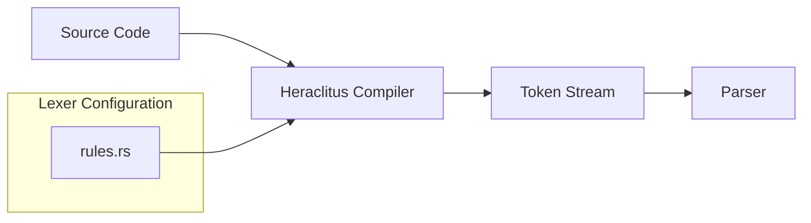
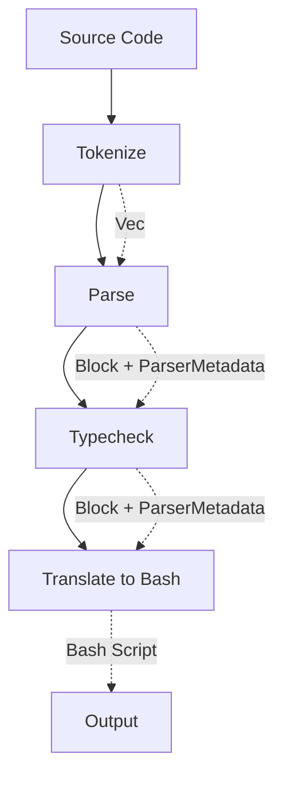

# Amber Compiler Lexer

This document explains how the Amber compiler performs lexical analysis (lexing/tokenization) of source code.

## Overview

Amber uses the **[heraclitus-compiler](https://crates.io/crates/heraclitus-compiler)** crate as its compiler frontend. This library handles the lexing step, converting raw source code into a stream of tokens that the parser can consume.

The lexing process is initiated in `src/compiler.rs` and configured by rules defined in `src/rules.rs`.

## Architecture



## Tokenization Process

### 1. Compiler Initialization

When the `AmberCompiler` is created, it initializes the heraclitus `Compiler` with Amber-specific lexing rules:

```rust
// src/compiler.rs
pub fn new(code: String, path: Option<String>, options: CompilerOptions) -> AmberCompiler {
    let cc = Compiler::new("Amber", rules::get_rules());
    // ...
}
```

### 2. Tokenize Method

The `tokenize()` method delegates to the heraclitus compiler to convert source code into tokens:

```rust
pub fn tokenize(&self) -> Result<Vec<Token>, Message> {
    match self.cc.tokenize() {
        Ok(tokens) => Ok(tokens),
        Err((err_type, pos)) => {
            // Handle lexer errors (unclosed strings, regions, etc.)
        }
    }
}
```

### 3. Lexer Error Handling

The lexer can produce two types of errors:
- **`LexerErrorType::Singleline`** - A single-line construct (like a comment) wasn't properly closed
- **`LexerErrorType::Unclosed`** - A multi-line region (like a string or command) wasn't closed

## Lexing Rules

The lexer is configured in [`src/rules.rs`](file:///Users/pawelkaras/Desktop/Amber/Amber-Compiler/src/rules.rs) with three categories of rules:

### Symbols (Single Characters)

Individual characters that are recognized as tokens:

```rust
let symbols = vec![
    '+', '-', '*', '/', '%',      // Arithmetic operators
    '\n', ';', ':',               // Statement delimiters
    '(', ')', '[', ']', '{', '}', // Brackets
    ',', '.',                     // Separators
    '<', '>', '=', '!', '?',      // Comparison & special
];
```

### Compound Symbols (Two-Character Tokens)

Pairs of characters that form a single token:

| Compound | Meaning |
|----------|---------|
| `<=` | Less than or equal |
| `>=` | Greater than or equal |
| `!=` | Not equal |
| `==` | Equal |
| `+=` | Add-assign |
| `-=` | Subtract-assign |
| `*=` | Multiply-assign |
| `/=` | Divide-assign |
| `%=` | Modulo-assign |
| `..` | Range operator |
| `//` | Comment start |

### Regions (Delimited Content)

Regions are sections of code bounded by specific delimiters. The lexer handles them specially:

#### String Literals
```
"hello world"
```
- **Begin:** `"`
- **End:** `"`
- Supports **interpolation** with `{expression}`

#### Command Literals
```
$echo "hello"$
```
- **Begin:** `$`
- **End:** `$`
- Supports **interpolation** with `{expression}`

#### Compiler Flags (Attributes)
```
#[allow_absurd_cast]
```
- **Begin:** `#[`
- **End:** `]`

#### Comments
```
// This is a comment
```
- **Begin:** `//`
- **End:** `\n` (newline)
- `allow_unclosed_region: true` - Comments at end of file don't need newline
- `ignore_escaped: true` - No escape sequences in comments

#### Interpolation
```
{expression}
```
- **Begin:** `{`
- **End:** `}`
- `tokenize: true` - Content inside is recursively tokenized

## Interpolation Handling

A key feature of the Amber lexer is its support for **nested interpolation**. When the lexer encounters an interpolation region (`{...}`), it recursively tokenizes the content inside. This allows expressions to be embedded within:

- String literals: `"Hello, {name}!"`
- Command literals: `$echo {message}$`

The `ref global` directive in region definitions means these interpolation regions reference the global tokenization rules, enabling full expression parsing within interpolated sections.

## Compilation Pipeline

The lexer is the first stage in the Amber compilation pipeline:



This is orchestrated in the `compile()` method:

```rust
pub fn compile(&self) -> Result<(Vec<Message>, String), Message> {
    let tokens = self.tokenize()?;
    let (block, meta) = self.parse(tokens)?;
    let (block, meta) = self.typecheck(block, meta)?;
    let code = self.translate(block, meta)?;
    Ok((messages, code))
}
```

## Debugging

Set the `AMBER_DEBUG_TIME=1` environment variable to see tokenization timing:

```
[Tokenize]  in  5ms  /path/to/file.ab
```

## Related Files

| File | Description |
|------|-------------|
| [compiler.rs](file:///Users/pawelkaras/Desktop/Amber/Amber-Compiler/src/compiler.rs) | Main compiler orchestration, `tokenize()` method |
| [rules.rs](file:///Users/pawelkaras/Desktop/Amber/Amber-Compiler/src/rules.rs) | Lexer rule definitions |
| [grammar.ebnf](file:///Users/pawelkaras/Desktop/Amber/Amber-Compiler/grammar.ebnf) | Formal grammar specification |
