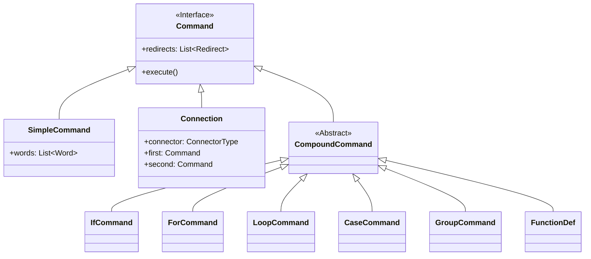
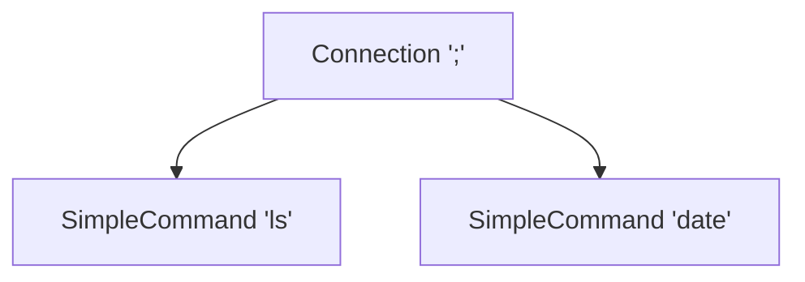
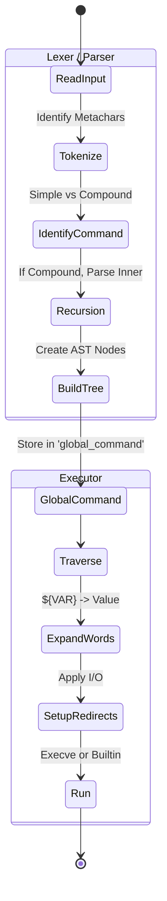

# Bash AST: The Abstract Mind Map

This map conceptualizes the internal structure of Bash's execution model. It abstracts away the C implementation details to focus on the logical relationships necessary for building a compatible parser.

## 1. The Core Concept: Polymorphic Commands

At the heart of Bash is the **COMMAND**. Everything is a command.
There is no distinction between a "script" and a "command". A script is just a `Connection` command of other commands.



## 2. The Atoms: Simple Commands

A `SimpleCommand` is where the actual work happens. It is defined by:
1.  **Words**: A sequence of text tokens. The first is usually the program name.
2.  **Redirects**: Instructions on how to manipulate File Descriptors *before* execution.

**Visual Model:**
`[ Word ]` -> `[ Word ]` -> `[ Word ]` ... `[ Redirect ]` -> `[ Redirect ]`

## 3. The Glue: Connections

Bash executes lists of commands. This is essentially a **Binary Tree**.
A script like `ls; date` is not a flat list, but a tree:



**Connector Types:**
- `&` (Background)
- `;` (Sequence)
- `|` (Pipe)
- `&&` (AND)
- `||` (OR)
- `\n` (Newline - effectively `;`)

The parser is **Left-Associative**. `cmd1 | cmd2 | cmd3` becomes:
```mermaid
graph TD
    Top[Connection '|']
    Top --> Left[Connection '|']
    Left --> L1[cmd1]
    Left --> L2[cmd2]
    Top --> Right[cmd3]
```

## 4. Control Flow: Compound Commands

Compounds wrap other commands (often lists/connections).

### If Command
Structure: `if TEST; then TRUE_CASE; else FALSE_CASE; fi`
- **Test**: A `Command` (Note: `[` is just a `SimpleCommand` named `test` or a builtin, `[[` is special).
- **TrueCase**: A `Command` (usually a `Connection`).
- **FalseCase**: A `Command`.

### Loop Command (While/Until)
Structure: `while TEST; do ACTION; done`
- **Test**: A `Command`.
- **Action**: A `Command`.

### For Command
Structure: `for NAME in WORDS; do ACTION; done`
- **Name**: Variable name (Word).
- **MapList**: List of Words to iterate over.
- **Action**: A `Command`.
*Note: `select` shares this structure.*

### Containers (Group / Subshell)
- **Group** `{ list; }`: Executes `list` in the *current* shell context.
- **Subshell** `( list )`: Executes `list` in a *forked* shell context.
- **Def**: Only contains a single `Command` (the list).

## 5. Lexical Complexity (The Hard Part)

The AST is simple. The Parser/Lexer is where the "mind map" gets complex because context determines tokenization.

**Key Rule**: The parsing of a `WORD` depends on the current state.
- **Normal**: Space splits words.
- **In Quotes**: Spaces are literal.
- **In `case`**: The lexer must know to accept `(` before a pattern.
- **In `for`**: The lexer must distinguish `in` or `do` as keywords vs words.
- **Alias Expansion**: Happens *before* tokenization generates the final AST.

## 6. Execution Flow Mind Map



## Summary for Reverse Engineering

1.  **Recursive AST**: Build your valid node types (`Simple`, `Connection`, `Compound`).
2.  **Binary Connections**: Implement command lists as connected binary nodes.
3.  **Context-Aware Lexing**: Your lexer cannot be stateless. It needs to know if it's "inside" a `CASE` pattern or "expecting" a `DO` keyword.
4.  **Separation of Concerns**:
    - **Parsing**: Structure only. `echo $foo` is parsed as `SimpleCommand` with words `echo` and `$foo`.
    - **Execution**: Expansion happens here. `$foo` becomes `bar` only when the node is visited. Do not expand during parsing.
