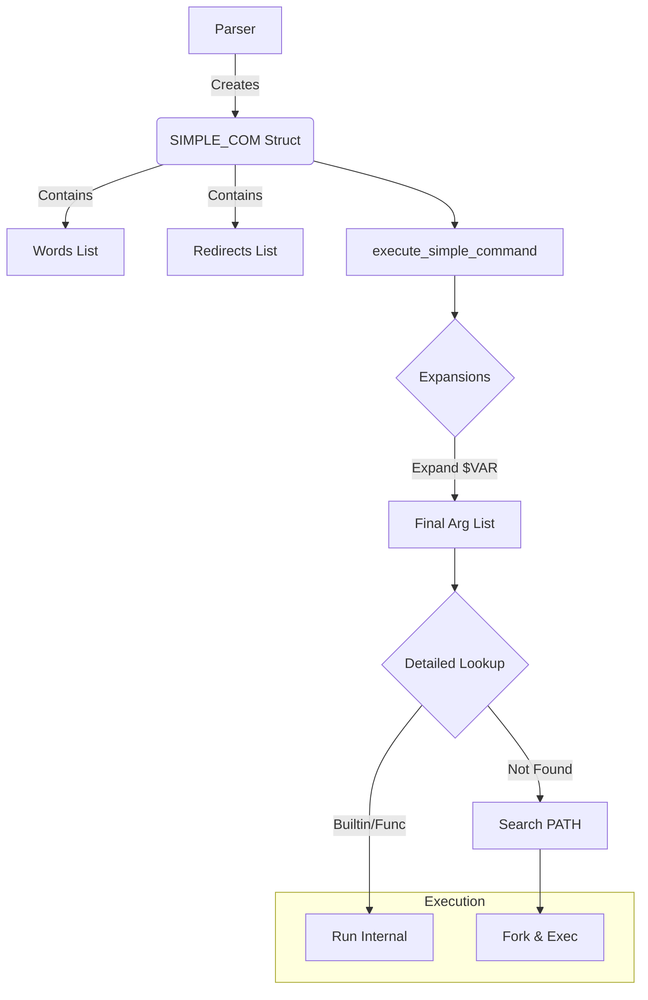

# Deep Analysis: Simple Command

The **Simple Command** is the atomic unit of execution in Bash. Unlike "Compound Commands" (like `if`, `while`, `{}`) which are structural containers, the Simple Command is where the actual action happens: variable assignments, running programs, and calling functions.

## 1. Data Structure

Defined in `command.h`, the `SIMPLE_COM` structure is surprisingly minimal. It essentially holds two lists: **Words** and **Redirects**.

```c
/* command.h */
typedef struct simple_command {
  int flags;              /* Execution flags (e.g. CMD_INHIBIT_EXPANSION) */
  int line;               /* Line number */
  WORD_LIST *words;       /* The command name + arguments + assignments */
  REDIRECT *redirects;    /* I/O descriptors */
} SIMPLE_COM;
```

### Key Components
1.  **words (`WORD_LIST`)**: A linked list of `WORD_DESC`.
    *   Contains the command name (e.g., `echo`), arguments (`"hello"`), *and* variable assignments (`VAR=val`) that appear before the command.
    *   Note: At the parsing stage, `VAR=val cmd` stores `VAR=val` in this list. Separation happens later.
2.  **redirects (`REDIRECT`)**: A linked list of I/O instructions.
    *   Examples: `> file`, `2>&1`, `<<EOF`.

## 2. Parsing (The Grammar)

The grammar in `parse.y` defines a `simple_command` as a recursive sequence of `simple_command_element`s.

```yacc
/* parse.y (simplified) */
simple_command:
      simple_command_element
    | simple_command simple_command_element
    ;

simple_command_element:
      WORD              { ... }
    | ASSIGNMENT_WORD   { ... }
    | redirection       { ... }
    ;
```

### Construction Logic (`make_cmd.c`)
The function `make_simple_command` is responsible for building this structure.
1.  It is called repeatedly as the parser consumes tokens.
2.  It appends to the `words` list or the `redirects` list depending on the element type.
3.  **Order Matters**: The parser maintains the order of words/redirects as they appear, which is crucial for argument parsing and correct redirection layering (e.g., `2>&1 >file` vs `>file 2>&1`).

## 3. Execution Lifecycle (`execute_cmd.c`)

The heavy lifting happens in `execute_simple_command`. This function transforms the static AST node into a running process.

### Step 1: Variable & Assignment Pre-Processing
Before expansion, Bash handles "assignment words" (tokens like `VAR=value` that appeared before the command name).
*   `fix_assignment_words()`: Identifies which words are assignments and which are the command/args.
*   **Crucial Logic**: If the command is *not* a shell function/builtin, assignments modify the *temporary environment* for that command only. If it is a builtin (like `export`), they might affect the current shell.

### Step 2: Expansion
This is the most critical difference between parsing and execution. The parser stores literal strings (e.g., `$VAR`). The executor converts them to values.
*   `expand_words()`: Performs brace expansion, tilde expansion, parameter expansion (`$VAR`), command substitution (`$(...)`), and arithmetic expansion.
*   **Result**: A new list of words where `$VAR` is replaced by `value`.

### Step 3: Command Resolution (The "Search")
Bash decides *what* to run in the following priority order:
1.  **Special Builtins**: (e.g., `break`, `return`). Found via `find_special_builtin`.
2.  **Functions**: User-defined functions. Found via `find_function`.
3.  **Regular Builtins**: (e.g., `echo`, `cd`). Found via `find_shell_builtin`.
4.  **Disk Commands**: Executables in `$PATH`. Handled later if the above fail.

*Optimization*: The code checks for `command` builtin usage to bypass function lookups if requested.

### Step 4: Forking and Execution
The flow diverges based on the resolution:

#### A. Internal (Builtin/Function)
1.  Environment variables from assignments are applied temporarily.
2.  Redirections are applied.
3.  The function/builtin code is executed directly in the current process (usually).
4.  Input/Output is restored.

#### B. External (Disk Command)
1.  **Fork**: A child process is created (`make_child`).
    *   This happens *early* if the command is in a pipeline or background (`&`).
2.  **Redirect**: `do_redirections()` manipulates the file descriptors (dup2).
3.  **Exec**: The child calls `execve` to replace itself with the binary program.

## Deep Dive: The "Assignment" Gotcha

A common confusion is how `VAR=val cmd` works.
- **In Parser**: `VAR=val` is just a word in the `SIMPLE_COM->words` list.
- **In Executor**:
    1.  Bash sees `cmd` is a disk command.
    2.  It forks.
    3.  In the *child*, it adds `VAR=val` to the environment variables.
    4.  It calls `execve`.
    -   *Crucially*: The parent shell's `VAR` is untouched.

However, if `cmd` is a **function**:
1.  Bash *does not* fork.
2.  It temporarily sets `VAR=val` in the current context.
3.  Runs the function.
4.  Restores `VAR`.

## Summary Flowchart


